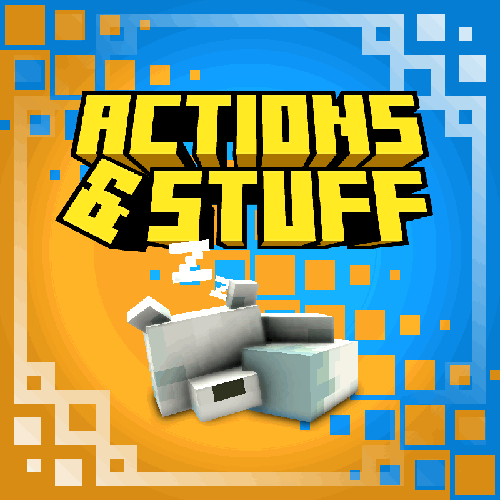

<!DOCTYPE html>
<html lang="id">
<head>
  <meta charset="UTF-8" />
  <meta name="viewport" content="width=device-width, initial-scale=1.0" />
  <title>Dex</title>
  
</head>
<body>

  

    <h1>Dex Web Server</h1>
    
Be Yours

    
00:00:00

  

  

    <i class="fas fa-bars"></i> NAVIGASI MENU
  

  

    
<i class="fas fa-home"></i> HOME

    
<i class="fas fa-file-alt"></i> PROJECT

    
<i class="fas fa-user"></i> STAFF

    
<i class="fas fa-envelope"></i> CONTACT

    
<i class="fas fa-folder"></i> ARCHIVE

  

  <!--
      

      <i class="fas fa-search"></i>
      <input type="text" id="search" placeholder="CARI MENU..." oninput="filterList()" />
    

  -->
  <!-- Konten Deskripsi -->
  <section data-title="Action & stuff">
    

      
    <h2>Action & Stuff</h2>
    

    
Action and Stuff adalah resource pack atau texture pack Minecraft Bedrock yang paling populer hingga saat ini. Texture pack ini memiliki banyak animasi player mob dan juga items.

  </section>

  

  <link rel="stylesheet" href="https://cdnjs.cloudflare.com/ajax/libs/font-awesome/6.5.0/css/all.min.css">
</body>
</html>
